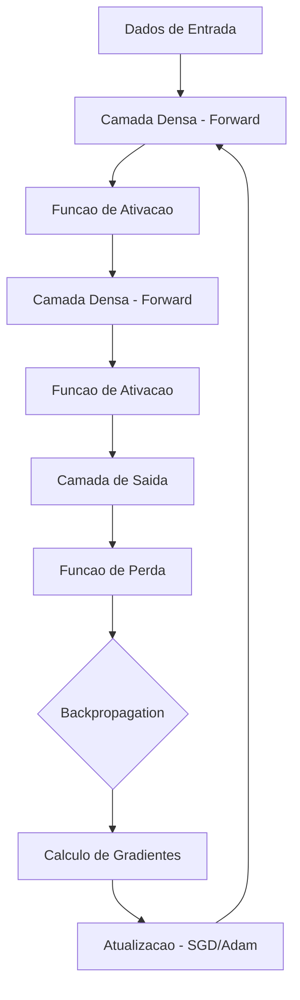
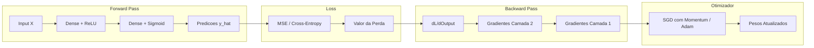
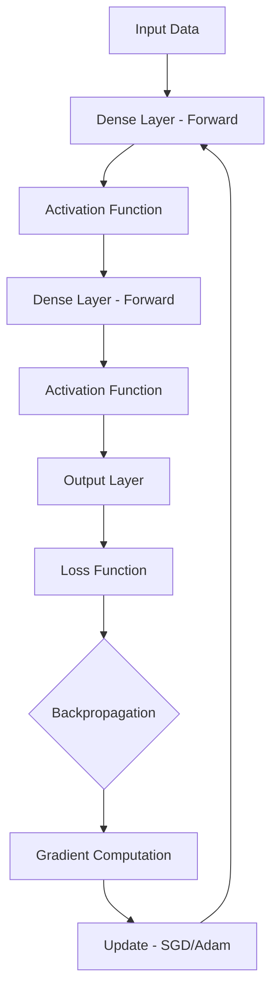
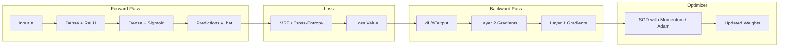

<div align="center">

# Neural Network Framework

[](https://www.python.org/)
[](https://numpy.org/)
[](tests/)
[](Dockerfile)
[](LICENSE)

**Framework de redes neurais construido do zero com NumPy puro -- backpropagation, otimizadores e API sequencial.**

**Neural network framework built from scratch with pure NumPy -- backpropagation, optimizers, and sequential API.**

[Portugues](#portugues) | [English](#english)

</div>

---

## Portugues

### Sobre

O **Neural Network Framework** e uma implementacao completa de redes neurais artificiais utilizando exclusivamente NumPy, sem dependencias de frameworks como TensorFlow ou PyTorch. O projeto implementa camadas densas com inicializacao He, funcoes de ativacao (ReLU, Sigmoid, Tanh, Softmax), funcoes de perda (MSE, Cross-Entropy, BCE), e otimizadores (SGD com momentum, Adam). A API sequencial permite construir, compilar e treinar redes com mini-batch gradient descent e validacao. O projeto resolve com sucesso o problema XOR, demonstrando aprendizado de funcoes nao-lineares.

### Tecnologias

| Camada | Tecnologia | Versao | Finalidade |
|--------|-----------|--------|------------|
| Core | Python | 3.11 | Linguagem principal |
| Numerico | NumPy | 1.26 | Algebra linear e operacoes matriciais |
| Testes | Pytest | 8.0+ | Suite de testes unitarios |
| API | Flask | 3.0 | Endpoint de servico |
| Infra | Docker | - | Containerizacao |

### Arquitetura



### Fluxo de Treinamento



### Estrutura do Projeto

```
Neural-Network-Framework/
├── src/
│   ├── __init__.py          # Modulo principal (8 LOC)
│   ├── layers.py            # Camada densa forward/backward (41 LOC)
│   ├── activations.py       # ReLU, Sigmoid, Tanh, Softmax (66 LOC)
│   ├── losses.py            # MSE, CrossEntropy, BCE (58 LOC)
│   ├── optimizers.py        # SGD, Adam (84 LOC)
│   └── network.py           # Modelo Sequential e treinamento (153 LOC)
├── tests/
│   └── test_neural_network.py  # Suite completa de testes (178 LOC)
├── examples/
│   └── README.md            # Guia de exemplos
├── app.py                   # API Flask para servico (30 LOC)
├── Dockerfile               # Container Python (12 LOC)
├── requirements.txt         # Dependencias
├── .gitignore
└── LICENSE                  # MIT
```

**Total: ~630 linhas de codigo-fonte**

### Inicio Rapido

```bash
git clone https://github.com/galafis/Neural-Network-Framework.git
cd Neural-Network-Framework
pip install -r requirements.txt
```

```python
from src.network import Sequential
from src.layers import Dense
from src.activations import ReLU, Sigmoid
import numpy as np

# Problema XOR
X = np.array([[0,0],[0,1],[1,0],[1,1]], dtype=float)
y = np.array([[0],[1],[1],[0]], dtype=float)

model = Sequential()
model.add(Dense(2, 8, seed=42))
model.add(ReLU())
model.add(Dense(8, 1, seed=43))
model.add(Sigmoid())
model.compile(optimizer="adam", loss="mse", learning_rate=0.05)

model.fit(X, y, epochs=500, verbose=True)
print(model.predict(X))
print(model.summary())
```

### Docker

```bash
docker build -t neural-framework .
docker run -p 8000:8000 neural-framework
```

### Testes

```bash
pytest tests/ -v
```

```
test_neural_network.py::TestDenseLayer::test_forward_shape        PASSED
test_neural_network.py::TestDenseLayer::test_backward_shape       PASSED
test_neural_network.py::TestActivations::test_relu_forward        PASSED
test_neural_network.py::TestActivations::test_sigmoid_range       PASSED
test_neural_network.py::TestActivations::test_softmax_sums_to_one PASSED
test_neural_network.py::TestLossFunctions::test_mse_zero_loss     PASSED
test_neural_network.py::TestOptimizers::test_sgd_update           PASSED
test_neural_network.py::TestOptimizers::test_adam_update           PASSED
test_neural_network.py::TestXORProblem::test_xor_convergence      PASSED
test_neural_network.py::TestNetworkSummary::test_summary          PASSED
```

### Benchmarks

| Operacao | Configuracao | Tempo |
|---------|-------------|-------|
| Forward pass | Dense(784, 128) + ReLU + Dense(128, 10) | < 1ms |
| XOR convergencia | 2-8-1 rede, 500 epocas | < 0.5s |
| Adam update | 10K parametros | < 0.1ms |
| Treinamento completo | MNIST-like, 1K amostras, 100 epocas | < 10s |

### Aplicabilidade Industrial

| Setor | Caso de Uso | Beneficio |
|-------|------------|-----------|
| Educacao | Ensino de deep learning | Compreensao de backpropagation sem caixa-preta |
| Pesquisa | Prototipagem rapida de arquiteturas | Iteracao sem overhead de frameworks |
| Embarcados | Inferencia em dispositivos limitados | Deploy sem dependencia de GPU/CUDA |
| Financeiro | Modelos de risco customizados | Controle total sobre gradientes e atualizacao |
| Industria | Deteccao de anomalias leve | Modelo compacto sem dependencias pesadas |

### Autor

**Gabriel Demetrios Lafis**
- GitHub: [@galafis](https://github.com/galafis)
- LinkedIn: [Gabriel Demetrios Lafis](https://linkedin.com/in/gabriel-demetrios-lafis)

### Licenca

Este projeto esta licenciado sob a Licenca MIT - veja o arquivo [LICENSE](LICENSE) para detalhes.

---

## English

### About

**Neural Network Framework** is a complete artificial neural network implementation using exclusively NumPy, with no dependency on frameworks like TensorFlow or PyTorch. The project implements dense layers with He initialization, activation functions (ReLU, Sigmoid, Tanh, Softmax), loss functions (MSE, Cross-Entropy, BCE), and optimizers (SGD with momentum, Adam). The sequential API enables building, compiling, and training networks with mini-batch gradient descent and validation. The project successfully solves the XOR problem, demonstrating non-linear function learning.

### Technologies

| Layer | Technology | Version | Purpose |
|-------|-----------|---------|---------|
| Core | Python | 3.11 | Primary language |
| Numeric | NumPy | 1.26 | Linear algebra and matrix operations |
| Testing | Pytest | 8.0+ | Unit test suite |
| API | Flask | 3.0 | Service endpoint |
| Infra | Docker | - | Containerization |

### Architecture



### Training Flow



### Project Structure

```
Neural-Network-Framework/
├── src/
│   ├── __init__.py          # Main module (8 LOC)
│   ├── layers.py            # Dense layer forward/backward (41 LOC)
│   ├── activations.py       # ReLU, Sigmoid, Tanh, Softmax (66 LOC)
│   ├── losses.py            # MSE, CrossEntropy, BCE (58 LOC)
│   ├── optimizers.py        # SGD, Adam (84 LOC)
│   └── network.py           # Sequential model and training (153 LOC)
├── tests/
│   └── test_neural_network.py  # Full test suite (178 LOC)
├── examples/
│   └── README.md            # Examples guide
├── app.py                   # Flask API for serving (30 LOC)
├── Dockerfile               # Python container (12 LOC)
├── requirements.txt         # Dependencies
├── .gitignore
└── LICENSE                  # MIT
```

**Total: ~630 lines of source code**

### Quick Start

```bash
git clone https://github.com/galafis/Neural-Network-Framework.git
cd Neural-Network-Framework
pip install -r requirements.txt
```

```python
from src.network import Sequential
from src.layers import Dense
from src.activations import ReLU, Sigmoid
import numpy as np

# XOR Problem
X = np.array([[0,0],[0,1],[1,0],[1,1]], dtype=float)
y = np.array([[0],[1],[1],[0]], dtype=float)

model = Sequential()
model.add(Dense(2, 8, seed=42))
model.add(ReLU())
model.add(Dense(8, 1, seed=43))
model.add(Sigmoid())
model.compile(optimizer="adam", loss="mse", learning_rate=0.05)

model.fit(X, y, epochs=500, verbose=True)
print(model.predict(X))
print(model.summary())
```

### Docker

```bash
docker build -t neural-framework .
docker run -p 8000:8000 neural-framework
```

### Tests

```bash
pytest tests/ -v
```

```
test_neural_network.py::TestDenseLayer::test_forward_shape        PASSED
test_neural_network.py::TestDenseLayer::test_backward_shape       PASSED
test_neural_network.py::TestActivations::test_relu_forward        PASSED
test_neural_network.py::TestActivations::test_sigmoid_range       PASSED
test_neural_network.py::TestActivations::test_softmax_sums_to_one PASSED
test_neural_network.py::TestLossFunctions::test_mse_zero_loss     PASSED
test_neural_network.py::TestOptimizers::test_sgd_update           PASSED
test_neural_network.py::TestOptimizers::test_adam_update           PASSED
test_neural_network.py::TestXORProblem::test_xor_convergence      PASSED
test_neural_network.py::TestNetworkSummary::test_summary          PASSED
```

### Benchmarks

| Operation | Configuration | Time |
|-----------|--------------|------|
| Forward pass | Dense(784, 128) + ReLU + Dense(128, 10) | < 1ms |
| XOR convergence | 2-8-1 network, 500 epochs | < 0.5s |
| Adam update | 10K parameters | < 0.1ms |
| Full training | MNIST-like, 1K samples, 100 epochs | < 10s |

### Industry Applicability

| Sector | Use Case | Benefit |
|--------|----------|---------|
| Education | Deep learning teaching | Understanding backpropagation without black boxes |
| Research | Rapid architecture prototyping | Iteration without framework overhead |
| Embedded | Inference on constrained devices | Deployment without GPU/CUDA dependency |
| Finance | Custom risk models | Full control over gradients and updates |
| Manufacturing | Lightweight anomaly detection | Compact model with no heavy dependencies |

### Author

**Gabriel Demetrios Lafis**
- GitHub: [@galafis](https://github.com/galafis)
- LinkedIn: [Gabriel Demetrios Lafis](https://linkedin.com/in/gabriel-demetrios-lafis)

### License

This project is licensed under the MIT License - see the [LICENSE](LICENSE) file for details.
