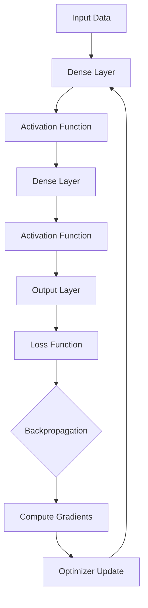
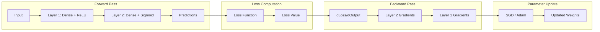
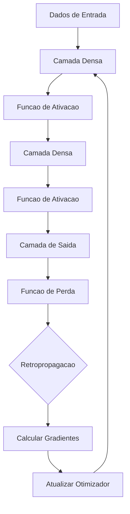

# Neural Network Framework

<div align="center">


</div>

**[English](#english)** | **[Portugues (BR)](#portugues-br)**

---

## English

### Overview

A neural network framework built entirely from scratch using only NumPy. Implements dense layers, multiple activation functions (ReLU, Sigmoid, Softmax, Tanh), loss functions (MSE, Cross-Entropy), and optimizers (SGD with momentum, Adam). Includes a sequential model API, training loop with mini-batch support, and XOR learning demonstration.

### Architecture



### Training Loop



### Features

- **Dense Layers**: Fully connected layers with He weight initialization
- **Activations**: ReLU, Sigmoid, Tanh, Softmax
- **Loss Functions**: MSE, Categorical Cross-Entropy, Binary Cross-Entropy
- **Optimizers**: SGD (with momentum), Adam
- **Sequential API**: Easy model building with `.add()` and `.compile()`
- **Training**: Mini-batch gradient descent with validation support
- **XOR Demo**: Demonstrates learning non-linear functions

### Project Structure

```
Neural-Network-Framework/
├── src/
│   ├── __init__.py
│   ├── layers.py          # Dense layer with forward/backward
│   ├── activations.py     # ReLU, Sigmoid, Tanh, Softmax
│   ├── losses.py          # MSE, CrossEntropy, BCE
│   ├── optimizers.py      # SGD, Adam
│   └── network.py         # Sequential model and training
├── tests/
│   └── test_neural_network.py
├── requirements.txt
└── README.md
```

### Usage

```python
from src.network import Sequential
from src.layers import Dense
from src.activations import ReLU, Sigmoid
import numpy as np

# XOR problem
X = np.array([[0,0],[0,1],[1,0],[1,1]], dtype=float)
y = np.array([[0],[1],[1],[0]], dtype=float)

model = Sequential()
model.add(Dense(2, 8, seed=42))
model.add(ReLU())
model.add(Dense(8, 1, seed=43))
model.add(Sigmoid())
model.compile(optimizer="adam", loss="mse", learning_rate=0.05)

model.fit(X, y, epochs=500, verbose=True)
print(model.predict(X))
print(model.summary())
```

### Running Tests

```bash
pytest tests/ -v
```

### Author

**Gabriel Demetrios Lafis**
- [GitHub](https://github.com/galafis)
- [LinkedIn](https://www.linkedin.com/in/gabriel-demetrios-lafis-62197711b)

---

## Portugues BR

### Visao Geral

Um framework de redes neurais construido inteiramente do zero usando apenas NumPy. Implementa camadas densas, multiplas funcoes de ativacao (ReLU, Sigmoid, Softmax, Tanh), funcoes de perda (MSE, Cross-Entropy) e otimizadores (SGD com momentum, Adam). Inclui API sequencial, loop de treinamento com mini-batch e demonstracao de aprendizado XOR.

### Arquitetura



### Funcionalidades

- **Camadas Densas**: Camadas totalmente conectadas com inicializacao He
- **Ativacoes**: ReLU, Sigmoid, Tanh, Softmax
- **Funcoes de Perda**: MSE, Cross-Entropy Categorica, Cross-Entropy Binaria
- **Otimizadores**: SGD (com momentum), Adam
- **API Sequencial**: Construcao facil com `.add()` e `.compile()`
- **Treinamento**: Gradiente descendente mini-batch com validacao
- **Demo XOR**: Demonstra aprendizado de funcoes nao-lineares

### Executando os Testes

```bash
pytest tests/ -v
```

---

## License

MIT License - see [LICENSE](LICENSE) for details.
